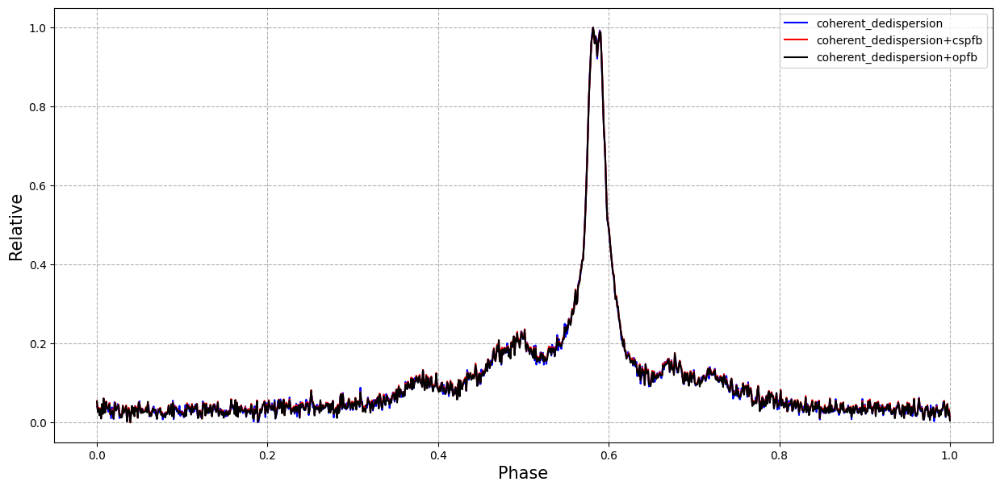

# polyphase filter

## data format

pulsar baseband data for psrdada (CASPSR backend)

## run

### only coherent_dedispersion
```
python3 main.py
```

### coherent_dedispersion+pfb(combine)
```
python3 main_pfb.py
```

### coherent_dedispersion+pfb(subband)
```
python3 main_subpfb.py
```

## result


